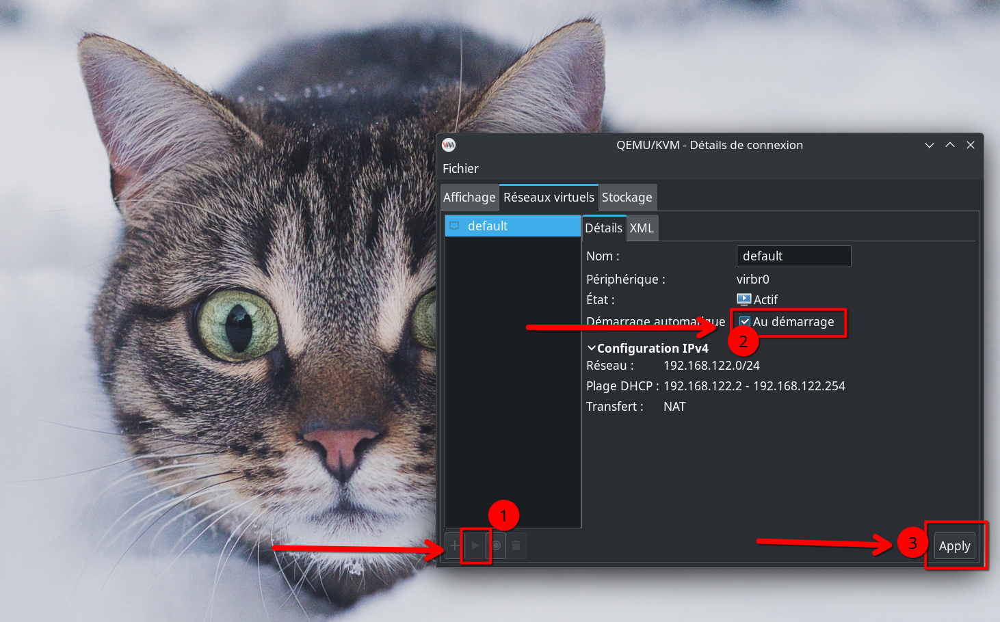

# Installation de KVM, QEMU et Virt-Manager sur Arch Linux et Fedora

Ce dépot contient au choix un script Bash ou un guide pour installer et configurer KVM (Kernel-based Virtual Machine), QEMU, et Virt-Manager sur des systèmes base **Arch Linux, Manjaro et Fedora**.

## Table des matières

- [Prérequis](#prérequis)
- [Installation avec le script](#installation-avec-le-script)
  - [Ce que fait le script](#ce-que-fait-le-script)
- [Installation à la main](#installation-à-la-main)
  - [Installation des paquets nécessaires](#installation-des-paquets-nécessaires)
  - [Configuration du service `libvirtd`](#configuration-du-service-libvirtd)
  - [Configuration des permissions](#configuration-des-permissions)
  - [Redémarrage du système](#redémarrage-du-système)
- [Après le script](#après-le-script)

## Prérequis

- Un système base Arch Linux, Manjaro ou Fedora avec accès sudo.
- Une connexion internet active pour télécharger les paquets nécessaires.
- Votre processeur doit supporter la virtualisation (Intel VT-x ou AMD-V).
- La virtualisation Intel VT-x ou AMD-V doit être activée dans le bios.

## Installation avec le script

```bash
git clone https://codeberg.org/Gaming-Linux-FR/KVM-QEMU-Virt-Manager
cd KVM-QEMU-Virt-Manager
chmod +x install.sh
sudo ./install.sh
```

### Ce que fait le script

1. **Mise à jour du système** : Le script commence par mettre à jour les paquets de votre système pour s'assurer que toutes les dépendances sont actuelles.
2. **Installation des paquets** : Installe QEMU, Virt-Manager, et d'autres outils nécessaires pour la gestion des VM.
3. **Configuration des permissions** : Configure `/etc/libvirt/libvirtd.conf` pour permettre à l'utilisateur actuel de gérer les VM et ajoute l'utilisateur au groupe `libvirt`.
4. **Redémarrage des services nécessaires** : Pour que les changements prennent effet immédiatement.

## Installation à la main

### Installation des paquets nécessaires

Installez les paquets nécessaires pour KVM, QEMU et d'autres outils de gestion de la virtualisation :

Archlinux :

```bash
sudo pacman -S qemu virt-manager virt-viewer dnsmasq vde2 bridge-utils openbsd-netcat dmidecode libguestfs
```

Fedora :

```bash
dnf install -y @virtualization
```

### Configuration du service `libvirtd`

Activez et démarrez le service `libvirtd` :

```bash
sudo systemctl enable --now libvirtd.service
```

### Configuration des permissions

Modifiez les configurations pour permettre à l'utilisateur d'utiliser KVM :

```bash
sudo sed -i 's/#unix_sock_group = "libvirt"/unix_sock_group = "libvirt"/' /etc/libvirt/libvirtd.conf
sudo sed -i 's/#unix_sock_rw_perms = "0770"/unix_sock_rw_perms = "0770"/' /etc/libvirt/libvirtd.conf
sudo systemctl restart libvirtd.service
```

Ajoutez votre utilisateur au groupe `libvirt` :

```bash
sudo usermod -a -G libvirt $(whoami)
```

### Redémarrage du système

Après avoir terminé la configuration, il est conseillé de redémarrer votre système pour que toutes les modifications prennent effet :

```bash
sudo reboot
```

## Après le script

Il faudra juste activer la connexion comme sur la capture d'écran ci-dessous et vous êtes bon pour créer une VM.

