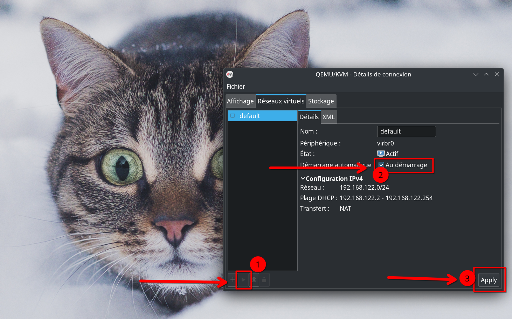

# Installation of KVM, QEMU, and Virt-Manager (Modular Architecture)

This repository provides a Bash script and a detailed guide to install and configure KVM, QEMU, and Virt-Manager. It is specifically updated to support the **new modular Libvirt architecture** on **Arch Linux, Manjaro, Debian, Ubuntu, and Fedora**.

## Table of Contents

- [Prerequisites](#prerequisites)
- [Installation with the Script](#installation-with-the-script)
  - [What the Script Does](#what-the-script-does)
- [Manual Installation](#manual-installation)
  - [1. Package Installation](#1-package-installation)
  - [2. Transition to Modular Daemons](#2-transition-to-modular-daemons)
  - [3. Group Permissions](#3-group-permissions)
- [Post-Installation](#post-installation)
- [Firewall and Security](#firewall-and-security)

---

## Prerequisites

*   A system based on Arch, Debian/Ubuntu, or Fedora with `sudo` access.
*   Processor supporting hardware virtualization (**Intel VT-x** or **AMD-V**) enabled in the BIOS.
*   Git installed:
    *   **Arch**: `sudo pacman -S git`
    *   **Fedora**: `sudo dnf install git`
    *   **Debian/Ubuntu**: `sudo apt update && sudo apt install git`

---

## Installation with the Script

This is the recommended method. It automatically handles the migration from the old monolithic daemon to the new modular services.
```bash
git clone [https://github.com/Cardiacman13/kvm-qemu-virt-manager.git](https://github.com/Cardiacman13/kvm-qemu-virt-manager.git)
cd kvm-qemu-virt-manager
chmod +x install.sh
sudo ./install.sh
```

### What the Script Does

1.  **System Update**: Ensures all dependencies are current.
2.  **Package Installation**: Installs QEMU, Virt-Manager, and bridge utilities.
3.  **Modular Migration**: Stops and masks the old `libvirtd` service to prevent conflicts.
4.  **Service Activation**: Enables the specific modular sockets (`virtqemud`, `virtnetworkd`, etc.) required for virtualization.
5.  **User Permissions**: Adds your user to the `libvirt` and `kvm` groups.

---

## Manual Installation

### 1. Package Installation

**Arch Linux / Manjaro:**
```bash
sudo pacman -S qemu-full virt-manager virt-viewer dnsmasq vde2 bridge-utils openbsd-netcat dmidecode libguestfs
```

**Fedora:**
```bash
sudo dnf install -y @virtualization
```

**Debian / Ubuntu:**
```bash
sudo apt update && sudo apt install -y virt-manager
```

### 2. Transition to Modular Daemons

Libvirt is moving away from the monolithic `libvirtd` daemon [documentation](https://libvirt.org/daemons.html#modular-driver-daemons). You must now use modular daemons for better stability and security.

**Stop and mask the old service:**
```bash
sudo systemctl stop libvirtd.service
sudo systemctl disable libvirtd.service
sudo systemctl mask libvirtd.service
```

**Enable the new modular sockets:**
Run this loop to activate the necessary drivers (QEMU, Network, Storage, etc.):
```bash
for drv in qemu interface network nodedev nwfilter secret storage
do
  sudo systemctl unmask virt${drv}d.socket
  sudo systemctl enable --now virt${drv}d.socket
done
```

### 3. Group Permissions

Add your user to the management groups. **Note:** Settings like `unix_sock_group` in `libvirtd.conf` are ignored when using systemd socket activation. Group access is now managed directly via the system groups:

```bash
sudo usermod -a -G libvirt $(whoami)
sudo usermod -a -G kvm $(whoami)
```

---

## Post-Installation

1.  **Reboot**: A full reboot is required for group changes to take effect.
2.  **Virt-Manager**: Open Virt-Manager and activate the connection to "QEMU/KVM" as shown below:



---

## Firewall and Security

If you encounter network issues with your VMs, ensure your firewall allows Libvirt traffic.

### UFW (Debian/Ubuntu)
```bash
sudo ufw allow libvirtd
sudo ufw reload
```

### Firewalld (Fedora/Arch)
```bash
sudo firewall-cmd --add-service=libvirt --permanent
sudo firewall-cmd --add-service=virt-manager --permanent
sudo firewall-cmd --reload
```

> **Warning:** Do not attempt to modify socket permissions in `/etc/libvirt/libvirtd.conf` anymore. If you need custom socket permissions, you must now override the systemd `.socket` unit files.
